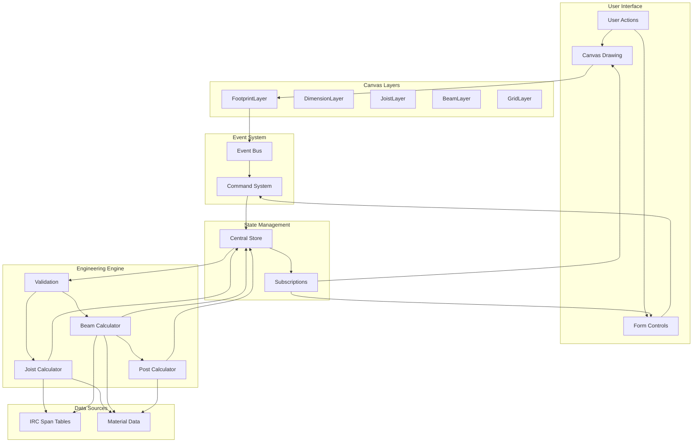
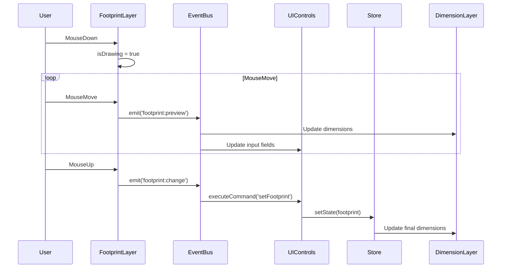
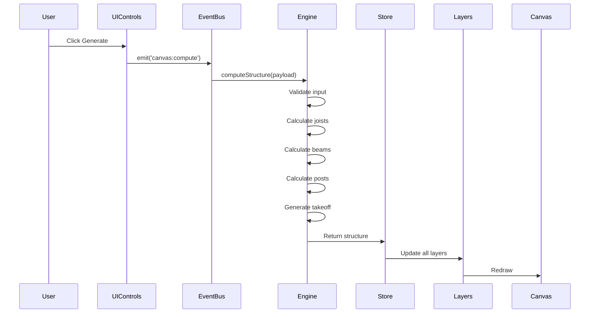
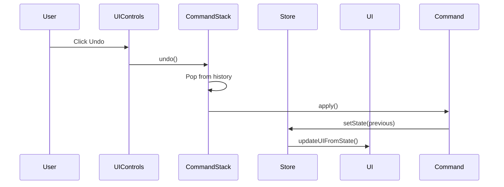

# Component Relationships and Data Flow

## Component Interaction Map



## Data Flow Sequences

### 1. Drawing a Footprint



### 2. Generating Structure



### 3. Undo Operation



## Component Dependencies

### Direct Dependencies

```
controls.js
├── command.js
├── store.js
├── eventBus.js
└── persistence.js

main.js
├── eventBus.js
├── command.js
├── store.js
├── canvas.js
├── all layer files
├── controls.js
├── engine/index.js
└── persistence.js

engine/index.js
├── validation.js
├── joist.js
├── beam.js
├── post.js
└── materials.js

canvas.js
└── (no direct dependencies)
```

### Event Dependencies

```
EventBus Events:
├── footprint:change
│   ├── Emitted by: FootprintLayer
│   └── Handled by: main.js → UIControls
├── footprint:preview
│   ├── Emitted by: FootprintLayer
│   └── Handled by: main.js → UI updates
├── canvas:compute
│   ├── Emitted by: UIControls
│   └── Handled by: main.js → Engine
└── canvas:ready
    ├── Emitted by: main.js
    └── Handled by: (none currently)
```

### Store Subscriptions

```
Store Subscribers:
├── main.js
│   ├── Updates canvas layers
│   ├── Updates joist visualization
│   └── Updates beam visualization
└── controls.js (indirect via commands)
    ├── Updates form fields
    └── Updates UI state
```

## Critical Paths

### 1. User Input → Visual Feedback
```
Fastest Path (Preview):
User Mouse → FootprintLayer → EventBus → UI Update
Latency: ~5-10ms

Slowest Path (Structure Generation):
User Click → UIControls → EventBus → Engine → Store → All Layers → Canvas
Latency: ~100-200ms
```

### 2. State Change → UI Update
```
Command Path:
User Action → Command → Store → Subscriptions → UI Components
Latency: ~20-30ms

Direct Path:
Event → Store → Subscriptions → UI Components
Latency: ~10-15ms
```

## Coupling Analysis

### Tight Coupling Points

1. **Canvas System**
   - All layers depend on DrawingSurface
   - Layers know about each other's existence
   - Direct state access in some places

2. **Engine Components**
   - Direct span table access
   - Shared material data references
   - Cross-component calculations

3. **UI Controls**
   - Mixed responsibilities
   - Direct DOM manipulation
   - Command creation logic embedded

### Loose Coupling Points

1. **Event System**
   - Publishers don't know subscribers
   - Clean event interface
   - Asynchronous communication

2. **Command Pattern**
   - Encapsulated operations
   - Consistent interface
   - Reversible actions

3. **Store Pattern**
   - Single source of truth
   - Immutable updates
   - Subscription-based updates

## Data Transform Points

### Input Transformations
```
User Input → Validation → Normalized Data
├── Footprint: pixels → feet
├── Dimensions: display → internal
└── Options: UI values → engine format
```

### Output Transformations
```
Engine Output → Display Format
├── Calculations: internal → user-friendly
├── Coordinates: feet → pixels
└── Measurements: decimal → feet-inches
```

### State Transformations
```
Commands ↔ Store State
├── Forward: apply state changes
├── Reverse: undo state changes
└── Merge: combine partial updates
```

## Message Flow Patterns

### 1. Request-Response
- Generate button → Engine calculation → Result

### 2. Publish-Subscribe
- Footprint changes → Multiple UI updates
- Store changes → Layer updates

### 3. Command Pattern
- User actions → Undoable operations

### 4. Observer Pattern
- Store state → Reactive UI updates

## Performance Implications

### Hot Paths
1. Mouse move events during drawing
2. Canvas redraw operations
3. Preview event handling

### Bottlenecks
1. Full canvas redraws
2. Synchronous calculations
3. Unbatched DOM updates

### Optimization Opportunities
1. Dirty rectangle tracking
2. Event debouncing
3. Calculation memoization
4. Virtual DOM or RAF batching